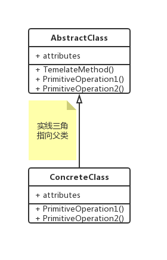

## 模板方法模式 Template Method

### **模式定义**

```
定义一个操作中的算法的骨架(稳定)，而将一些步骤延迟(变化)到子类中。

Template Method 使得子类可以不改变(复用)一个算法的结构即可重定义(override 重写)该算法的某些特定步骤。

                                                                      ——《设计模式》GoF
```

### **动机**

```
1. 在软件构建过程中，对于某一项任务，它常常有稳定的整体操作结构，但各个子步骤却有很多改变的需求，或者由于固有的原因（比如框架与应用之间的关系）而无法和任务的整体结构同时实现。

2. 如何在确定稳定操作的前提下，灵活应对各个子步骤的变化或者晚期实现需求？
```

### **适用性**

```
1. 一次性实现一个算法不变的部分，并将可变的部分留给子类来实现。

2. 各子类中公共的行为应被提取出来并集中到一个公共父类中以避免代码重复。
   1）首先识别现有代码的不同之处，并将不同之处分离为新的操作。
   2）最后，用一个调用这些新操作的模板方法来替换这些不同的代码。

3. 控制子类扩展。
```

### **模式类图(Structure)**



### 要点总结

```
1. Template Method 模式是一种非常基础性的设计模式，在面向对象系统中有着大量的应用。它用最简洁的机制(多态)为很多应用程序框架提供了灵活的扩展点，是代码复用方面基本的实现结构。

2. 除了可以灵活应对子步骤的变化外，“不要调用我，让我来调用你”的反向控制结构是 Template Method 的典型应用。

3. 在具体实现方面，被 Template Method 调用的抽象方法，可以有实现，也可以没有任何实现(抽象方法)，但一般推荐将它们设置为 protected 方法。
```

### **代码实现**

**模拟场景：我和女朋友的日常生活**

1. 日常生活模板类：[AbstractDailyLife.java](https://github.com/jiangshuangjun/mystudy/blob/master/design-pattern/src/main/java/study/pattern/templatemethod/AbstractDailyLife.java)
2. 我的日常生活类：[MyDailyLife.java](https://github.com/jiangshuangjun/mystudy/blob/master/design-pattern/src/main/java/study/pattern/templatemethod/MyDailyLife.java)
3. 女朋友日常生活类：[MyGirlDailyLife.java](https://github.com/jiangshuangjun/mystudy/blob/master/design-pattern/src/main/java/study/pattern/templatemethod/MyGirlDailyLife.java)
4. 场景测试类：[AbstractDailyLifeTest.java](https://github.com/jiangshuangjun/mystudy/blob/master/design-pattern/src/test/java/study/pattern/templatemethod/AbstractDailyLifeTest.java)